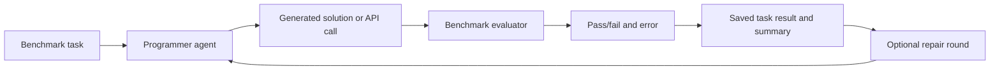

# AgentCoder Benchmark Comparison

## 1. Objective

This report evaluates the AgentCoder workflow on three different benchmark types:

- **MBPP**: Python function generation and unit-test execution.
- **DS-1000**: Data-science code generation across seven Python libraries.
- **API-Bank**: Tool/API-call generation from multi-turn conversations.

The same Kilo Gateway configuration was used for fresh generation. Results were stored per task so generated output, request status, execution result, and pass/fail status can be inspected.

## 2. AgentCoder Workflow



The experiment measures both model quality and operational reliability. A failed API request is different from a generated answer that executes but fails the benchmark tests.

## 3. Results At A Glance

| Benchmark | Evaluation unit | Tasks / turns | Passed | Overall accuracy | Successful model requests | Request failures / empty | Result file |
|---|---:|---:|---:|---:|---:|---:|---|
| MBPP, stored answers | Python task | 257 | 230 | 89.5% | Not applicable | Not applicable | `dataset/mbpp_existing_evaluation.json` |
| MBPP, fresh AgentCoder | Python task | 257 | 129 | 50.2% | 105 | 152 | `dataset/mbpp_agent_evaluation.json` |
| DS-1000 | Data-science task | 1,000 | 19 | 1.9% | 510 | 490 | `dataset/ds1000_agent_results.json` |
| API-Bank level 1 | API-call turn | 389 | 28 | 7.2% | 282 | 107 | `dataset/api_bank_level_1_agent_results.json` |
| API-Bank level 2 | API-call turn | 119 | 18 | 15.1% | 82 | 37 | `dataset/api_bank_level_2_agent_results.json` |

### MBPP Baseline Note

The original stored MBPP metadata reports `229/257`, while a fresh local execution of the stored completions reports `230/257`. The fresh AgentCoder run generated new code for all 257 tasks and passed `129/257`.

## 4. MBPP

### What It Tests

MBPP tests short Python programming tasks with assertions. The evaluator writes the generated function and its test assertions to a temporary Python file and executes it in a subprocess.

### AgentCoder Result

- Fresh tasks sent to the programmer agent: `257`
- Successful generated responses: `105`
- Empty responses: `41`
- Failed requests: `111`
- Fresh generated solutions passing tests: `129/257`
- Accuracy: `50.2%`

### Interpretation

MBPP is the strongest of the three fresh-generation results because tasks are short and test cases are direct. The result is still constrained by Kilo free-model timeouts and empty responses. The stored historical answers are not a fair comparison to fresh generation because they were produced by a different model/run.

## 5. DS-1000

### What It Tests

DS-1000 contains 1,000 data-science tasks involving Matplotlib, NumPy, Pandas, PyTorch, SciPy, scikit-learn, and TensorFlow. Each record includes an executable `code_context` containing the official test logic.

### Overall Result

- Tasks: `1,000`
- Successful model requests: `510`
- Failed model requests: `490`
- Passed: `19/1,000`
- Overall accuracy: `1.9%`

### Results By Library

| Library | Tasks | Passed | Accuracy |
|---|---:|---:|---:|
| Matplotlib | 155 | 0 | 0.0% |
| NumPy | 220 | 8 | 3.6% |
| Pandas | 291 | 11 | 3.8% |
| PyTorch | 68 | 0 | 0.0% |
| SciPy | 106 | 0 | 0.0% |
| scikit-learn | 115 | 0 | 0.0% |
| TensorFlow | 45 | 0 | 0.0% |

### Interpretation

DS-1000 is substantially harder than MBPP because prompts are longer, solutions depend on library-specific behavior, and execution requires a scientific Python environment. The free model also failed nearly half of requests, so the measured score combines model quality with provider reliability.

## 6. API-Bank

### What It Tests

API-Bank evaluates whether an agent can select the correct API and produce the correct parameters from a multi-turn conversation. The runner parses outputs in the form:

```text
[ApiName(key='value')]
```

The result is compared with the official API name and parameter dictionary.

### Results

| Split | API-call turns | Successful requests | Failed requests | Correct | Accuracy |
|---|---:|---:|---:|---:|---:|
| Level 1 | 389 | 282 | 107 | 28 | 7.2% |
| Level 2 | 119 | 82 | 37 | 18 | 15.1% |

### Interpretation

Level 2 has fewer examples but a higher measured accuracy. API-Bank requires structured tool selection, argument extraction, and conversation-state tracking. A natural-language answer can be useful but still fail if the API name or one parameter is incorrect.

## 7. Cross-Benchmark Comparison

| Dimension | MBPP | DS-1000 | API-Bank |
|---|---|---|---|
| Primary capability | Function coding | Library-aware data science coding | Tool/API usage |
| Output format | Python code | Python solution fragment | Structured API call |
| Evaluation | Assertions | Official executable test context | API name and parameter match |
| Main difficulty | Algorithm correctness | Library knowledge and runtime state | Planning and schema adherence |
| Fresh AgentCoder accuracy | 50.2% | 1.9% | 7.2% level 1; 15.1% level 2 |
| Main operational risk | Empty/failed requests | Long prompts, heavy libraries, timeouts | Long dialogues and provider failures |

## 8. Main Findings

1. **AgentCoder is most effective on compact, directly testable code tasks.** MBPP produced the highest fresh-generation accuracy.
2. **Data-science generation is the hardest workload.** DS-1000 requires both code synthesis and correct use of specialized libraries.
3. **API use is a different capability from code generation.** API-Bank needs structured output and correct tool arguments, not just executable Python.
4. **Provider reliability materially affects the scores.** Failed and empty Kilo responses must be reported separately from incorrect model answers.
5. **The benchmark evaluator must match the task type.** Python subprocess execution is appropriate for MBPP and DS-1000; API-Bank needs structured API-call scoring.

## 9. Limitations

- The experiments used Kilo's free model route, which produced timeouts, empty responses, and provider errors.
- MBPP stored-answer results were created by earlier model runs and are not a controlled baseline against the current Kilo model.
- The API-Bank runner scores API name and parameters against official dialogue ground truth. It does not claim to reproduce every detail of the original API-Bank response-generation and tool-search evaluation modes.
- DS-1000 execution depends on installed library versions and machine capabilities, especially for TensorFlow, PyTorch, and plotting tasks.
- Generated code is executed locally. Use an isolated environment or sandbox for untrusted model output.

## 10. Reproduction Commands

Run fresh MBPP AgentCoder generation and evaluation:

```powershell
cd Vanilla_Method/AgentCoder/src
python .\test_executor_mbpp.py
```

Run DS-1000 on all tasks:

```powershell
python .\run_ds1000.py
```

Run a smaller DS-1000 test first:

```powershell
python .\run_ds1000.py --limit 10 --timeout 120
```

Run API-Bank level 1:

```powershell
python .\run_api_bank.py --level 1
```

Run API-Bank level 2:

```powershell
python .\run_api_bank.py --level 2
```

Run only the existing MBPP answers without Kilo:

```powershell
python .\test_executor_mbpp.py --offline
```

## 11. Conclusion

AgentCoder demonstrates a complete generate-evaluate workflow across three increasingly different problem types. Its current strongest result is MBPP at `50.2%` with fresh Kilo generation. DS-1000 and API-Bank expose the limits of a general code-generation agent when tasks require specialized libraries, long context, structured tool calls, or reliable multi-turn reasoning. Future experiments should first improve provider reliability and then compare models under the same request-success rate.
